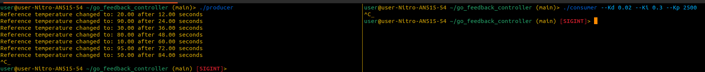

# GO Feedback Controller Simulation with Kafka Integration

This project implements a PID controller using Kafka to simulate temperature regulation based on sensor data. The system consists of a producer that sends sensor data to Kafka and a consumer that processes the data, calculates the PID control input, and logs it to a CSV file. The simulation can run for 100 seconds, generating a controlled environment for the PID loop.

## Prerequisites

Ensure the following are installed on your system:

- **Docker** and **Docker Compose**
- **Go** 1.18+
- **Python** 3.x (for the simulation script)

## Installation and Setup

### 1. Clone the Repository

```bash
git clone <repo_name>
cd <repo_name>
```

### 2. Build and Run the Project

The Makefile automates the setup and execution of the project. To start everything (Kafka, producer, and consumer), run:

```bash
make all
```

This will:

- Start Kafka using Docker Compose.
- Build the Kafka producer executable.
- Build the Kafka consumer executable.

### 3. Run the Simulation

## Kafka Producer

The **producer** simulates sensor data for the PID controller. It sends temperature reference, humidity, and the number of people in the room to a Kafka topic (`temperature_data`). The data is sent at regular intervals, enabling the consumer to process it.

To manually run the producer executable:

```bash
./producer
```

The producer continuously sends simulated data to Kafka until stopped.

## Kafka Consumer with PID Controller

The **consumer** processes the sensor data, calculates the PID control input, and logs the output to a CSV file.

### Customizing PID Parameters

The consumer allows customization of the PID controller parameters (`Kp`, `Ki`, `Kd`) using command-line flags:

```bash
./consumer --Kp <value> --Ki <value> --Kd <value>
```

For example:

```bash
./consumer --Kp 1200.0 --Ki 0.2 --Kd 0.05
```

If no flags are provided, the default values are loaded from the `config.yaml` file.

After running the producer and consumer for approximately 60–100 seconds, visualize the results using the Python simulation script:

```bash
make run-simulation
```

The script processes the CSV data generated by the consumer and plots a graph of the simulation.

### 4. Cleanup Resources

To stop Docker Compose and remove built executables, run:

```bash
make clean
```

### Additional Help

To view available options and flags:

```bash
./consumer --help
```

## Makefile Targets

The Makefile simplifies project execution. Here are the available targets:

- **`make all`**: Start Docker, build producer, and consumer.
- **`make docker-start`**: Start Docker Compose in detached mode.
- **`make build-producer`**: Build the producer executable.
- **`make build-consumer`**: Build the consumer executable.
- **`make run-simulation`**: Run the Python simulation script on the CSV data.
- **`make clean`**: Stop Docker and remove executables.
- **`make docker-stop`**: Stop Docker Compose containers.
- **`make help`**: Display the list of available commands.

## PID Controller Overview

The PID controller regulates temperature using the following components:

- **Kp (Proportional)**: Adjusts the response based on the current error.
- **Ki (Integral)**: Accumulates past errors to adjust over time.
- **Kd (Derivative)**: Reacts to the rate of change of the error.

The controller computes the control input based on sensor data (temperature reference, humidity, and room occupancy).

## Notes

- Run the producer and consumer for at least 60 seconds to generate sufficient data for simulation.
- The simulation script visualizes up to 100 seconds of data. To simulate longer durations, rerun the script or restart the producer and consumer.

### Commands -



### Simulation -


