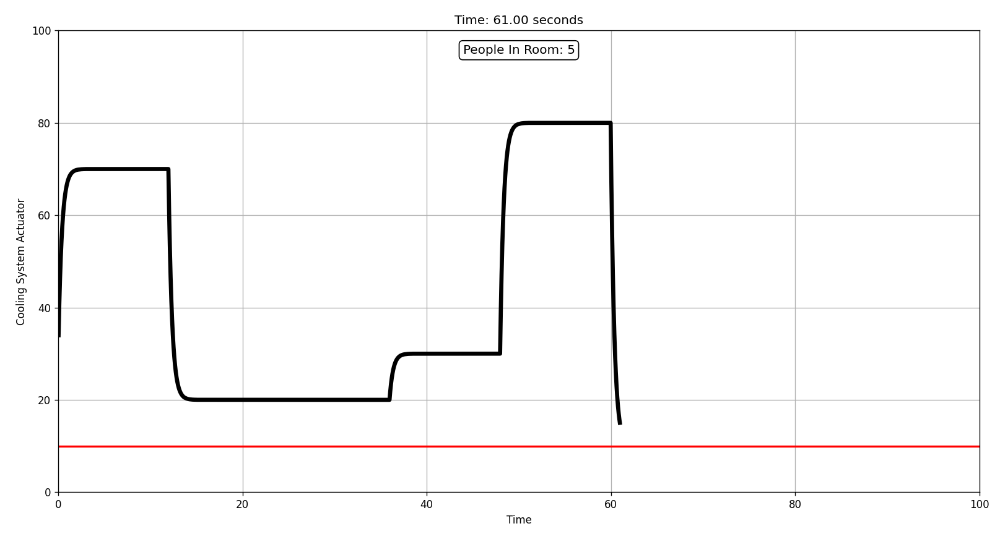

# GO Feedback Controller Simulation with Kafka Integration

This project implements a PID controller using Kafka to simulate temperature regulation based on sensor data. The system consists of a producer that sends sensor data to Kafka and a consumer that processes the data, calculates the PID control input, and logs it to a CSV file. The simulation can run for 100 seconds, generating a controlled environment for the PID loop.

## Prerequisites

Before running the project, ensure the following are installed on your system:

- Docker and Docker Compose
- Go 1.18+
- Python 3.x (for the simulation script)

## Installation and Setup

1. **Clone the Repository**:

   ```bash
   git clone <repo_name>
   cd <repo_name>
   ```

2. **Build and Run the Project** using Makefile:
   - To build and start all components (Kafka, producer, and consumer):

     ```bash
     make all
     ```

3. **Run Simulation**:
   - The project contains a Python simulation that reads the CSV data generated by the consumer and provides a visual graph (Will give better output after running producer and consumer for around 60-100 seconds):

     ```bash
     make simulation
     ```

   - Note: The simulation script works for 100 seconds, after which data needs to be updated manually or restarted.

## Kafka Producer

The **producer** simulates sensor data for the PID controller. It sends temperature reference, humidity, and the number of people in the room to a Kafka topic (`temperature_data`). The data is sent at regular intervals, allowing the consumer to process and calculate control inputs.

To run the producer executable (after building it):

```bash
./producer
```

The producer will continuously send simulated data to Kafka until manually stopped.

## How to Run the Consumer with Custom Parameters

The consumer uses Cobra and Viper to allow customization of the PID controller parameters (`Kp`, `Ki`, `Kd`) at runtime.

To run the consumer with specific values:

```bash
./consumer --Kp <value> --Ki <value> --Kd <value>
```

For example:

```bash
./consumer --Kp 1200.0 --Ki 0.2 --Kd 0.05
```

The default values are loaded from the `config.yaml` file if no flags are provided.

## Using the `--help` Flag

For additional help and to explore the available flags, you can run:

```bash
./consumer --help
```

This will list all available options and how to use them.

Additionally, the `make help` command can be used to see all the available make targets and their descriptions.

```bash
make help
```

This will display a summary of the different commands you can run, such as building the producer, consumer, starting/stopping Kafka, or running the simulation.

## Makefile Targets

Here are the main targets in the Makefile:

- `make all`: Builds producer, consumer, and starts Kafka in Docker Compose.
- `make producer`: Builds the Kafka producer executable.
- `make consumer`: Builds the Kafka consumer executable.
- `make start-kafka`: Starts Kafka using Docker Compose.
- `make stop-kafka`: Stops Kafka and removes the containers.
- `make simulation`: Runs the Python simulation script on the CSV data.
- `make help`: Lists all available Makefile commands.

## PID Controller

This project implements a PID (Proportional-Integral-Derivative) controller for temperature regulation:

- **Kp** (Proportional): Adjusts the response based on the current error.
- **Ki** (Integral): Accumulates past errors to adjust the system over time.
- **Kd** (Derivative): Reacts to the rate of change of the error.

The PID controller adjusts the temperature in response to sensor data (temperature reference, humidity, and people in the room) and calculates the necessary control input.

## Notes

- The producer simulates sensor data, and the consumer logs the processed data to a CSV file, which can later be used for analysis or simulation.
- The simulation script works for up to 100 seconds. If you need longer simulations, extend the duration of the sensor data or rerun the script.

### Example Screenshot


